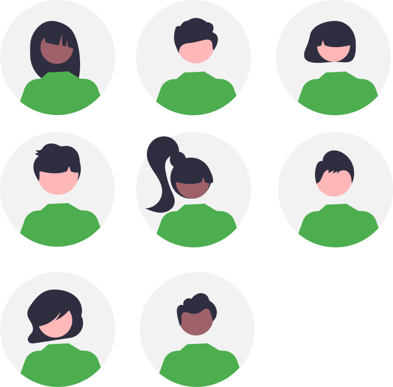

{: .center width=50%}

## Avertissement :

[{: align=left width=10%}](){target=_blank}[{: align=right width=10%}](mailto:)Ce site s'adresse aux élèves de seconde du lycée Notre Dame du Mur qui suivent l'enseignement de découverte des Sciences de l'Ingénieur.

## Contenu de formation :

- **Explorer** à travers différentes activités courtes le domaine des Sciences de l'Ingénieur :  

    - simulation et expérimentation de systèmes ;
    - programmation de cartes à microcontrôleur ;
    - modélisation et impression 3D...

{: .center width=50%}

[mail]: mailto:eric.madec@ecmorlaix.fr "eric.madec@ecmorlaix.fr"

<!-- ***

## Le 07/03

=== "CONTENU DE SÉANCE"

    - **Prise en main** de la programmation des Lego Mindstorms EV3 avec l'application : "EV3 Classroom" :
        1. **Hello !** => expérimenter afin d'expliquer comment fonctionne la communication avec la brique depuis une tablette et depuis un PC...  ;
        2. **Moteurs et capteurs** => programmer les différents capteurs et moteurs disponibles afin d'expliquer leur fonctionnement... ;
        3. **Se déplacer** => construire et programmer une base motrice afin d'expliquer le déplacement produit par les différentes instructions... ;
        4. **Fichier > Nouveau Projet**  =>  créer une nouvelle trame de programmation personnalisée et la partager...

=== "TRAVAIL À FAIRE"

    {: .center width=40%}

    - **Faire** la [mise à jour d'Obsidian pour découvrir les canvas](https://ericecmorlaix.github.io/adn-Tutoriel_Obsidian/7-Options_Plugins/#canvas){target=_blank} ;
    - **Finir** les [activités d'escape game pour l'accueil des troisièmes](https://ericecmorlaix.github.io/accueil_3/){target=_blank} ;
    - **Poursuivre**, avec votre code personnel, la programmation des objets connectés sur la [plateforme de France-IOI​​](https://amazon.quick-pi.org/){target="_blank"} ;
    - **Découvrir** d'avantage la [modélisation 3D avec BlocksCad](./blocksCAD){target="_blank"} ;    
    - **Simuler** une carte [BBC micro:bit](./bbc_microbit){target=_blank} ;
    - **Jouer** à résoudre le Casse Tête en ligne [ici (code JavaScript)](http://isn.si.lycee.ecmorlaix.fr/casseTete/){target=_blank} ou encore [là (code Scratch)](https://scratch.mit.edu/projects/179937454/){target=_blank} ;

***

## Le 28/02

=== "CONTENU DE SÉANCE"

    - **Réaliser** les [activités d'escape game pour l'accueil des troisièmes](https://ericecmorlaix.github.io/accueil_3/){target=_blank} ;

=== "TRAVAIL À FAIRE"

    - **Faire** la [mise à jour d'Obsidian pour découvrir les canvas](https://ericecmorlaix.github.io/adn-Tutoriel_Obsidian/7-Options_Plugins/#canvas){target=_blank} ;

***
## Du 31/01 au 06/02

=== "CONTENU DE SÉANCE"

    - Seconde synthèse de la programmation des objets connectés sur la [plateforme de France-IOI​​](https://amazon.quick-pi.org/){target="_blank"} et avec le notebook [Quick_Pi-Objets_connectes-Parcours_1.ipynb](https://nbviewer.org/urls/ericecmorlaix.github.io/2SI_2022-2023/Quick_Pi-Objets_connectes-Parcours_1.ipynb){target=_blank} [:fontawesome-solid-download:](https://ericecmorlaix.github.io/2SI_2022-2023/Quick_Pi-Objets_connectes-Parcours_1.ipynb){ .md-button .md-button--primary} ;
    
    - Seconde synthèse de la modélisation 3D avec [BlocksCAD](./blocksCAD){target="_blank"} -> ==**Défin n°2 : Modéliser un support imprimable**== ;

    - **Programmer** une carte [BBC micro:bit](./bbc_microbit){target=_blank} ;

=== "TRAVAIL À FAIRE"

    {: .center width=40%}

    - **Découvrir** [Ces 12 "jobs du futur" qui vont exploser](https://start.lesechos.fr/travailler-mieux/classements/ces-12-jobs-du-futur-qui-vont-exploser-1174984?xtor=CS2-11) ;
    - **Lire** les pages de présentation des spécialités [Siences de l'Ingénieur](http://si.lycee.ecmorlaix.fr/){target=_blank} et [Numérique et Siences Informatiques](http://si.lycee.ecmorlaix.fr/nsi){target=_blank} ;    
    - **Poursuivre**, avec votre code personnel, la programmation des objets connectés sur la [plateforme de France-IOI​​](https://amazon.quick-pi.org/){target="_blank"} ;
    - **Découvrir** d'avantage la [modélisation 3D avec BlocksCad](./blocksCAD){target="_blank"} ;    
    - **Simuler** une carte [BBC micro:bit](./bbc_microbit){target=_blank} ;
    - **Jouer** à résoudre le Casse Tête en ligne [ici (code JavaScript)](http://isn.si.lycee.ecmorlaix.fr/casseTete/){target=_blank} ou encore [là (code Scratch)](https://scratch.mit.edu/projects/179937454/){target=_blank} ;
   

***
## Le 24/01

=== "CONTENU DE SÉANCE"

    - Première synthèse de la programmation des objets connectés sur la [plateforme de France-IOI​​](https://amazon.quick-pi.org/){target="_blank"} et avec le notebook [Quick_Pi-Objets_connectes-Parcours_1.ipynb](https://nbviewer.org/urls/ericecmorlaix.github.io/2SI_2022-2023/Quick_Pi-Objets_connectes-Parcours_1.ipynb){target=_blank} [:fontawesome-solid-download:](https://ericecmorlaix.github.io/2SI_2022-2023/Quick_Pi-Objets_connectes-Parcours_1.ipynb){ .md-button .md-button--primary} ;
    
    
    - **S'initier** à la modélisation 3D avec [BlocksCAD](./blocksCAD){target="_blank"} ;

    - Première synthèse de la modélisation 3D avec [BlocksCAD](./blocksCAD){target="_blank"} ==**-> Impression 3D d'un pion**== ;

=== "TRAVAIL À FAIRE"

    {: .center width=40%}

    - **Découvrir** [Ces 12 "jobs du futur" qui vont exploser](https://start.lesechos.fr/travailler-mieux/classements/ces-12-jobs-du-futur-qui-vont-exploser-1174984?xtor=CS2-11) ;

    - **Poursuivre**, avec votre code personnel, la programmation des objets connectés sur la [plateforme de France-IOI​​](https://amazon.quick-pi.org/){target="_blank"} ;

    - **Découvrir** d'avantage la [modélisation 3D avec BlocksCad](./blocksCAD){target="_blank"} ;

   
     -->
<!-- ## Les 30/05 et 06/06

=== "CONTENU DE SÉANCE"

    Réaliser une petite application utilisant :

    - la modélisation 3D avec [BlocksCAD](./blocksCAD){target="_blank"} ;
    - la programmation d'une carte [BBC micro:bit](./bbc_microbit){target=_blank} ;

=== "TRAVAIL À FAIRE"

    {: .center width=40%}

    - **Découvrir** [Ces 12 "jobs du futur" qui vont exploser](https://start.lesechos.fr/travailler-mieux/classements/ces-12-jobs-du-futur-qui-vont-exploser-1174984?xtor=CS2-11) ;
    - **Lire** les pages de présentation des spécialités [Siences de l'Ingénieur](http://si.lycee.ecmorlaix.fr/){target=_blank} et [Numérique et Siences Informatiques](http://si.lycee.ecmorlaix.fr/nsi){target=_blank} ;    
    - **Poursuivre**, avec votre code personnel, la programmation des objets connectés sur la [plateforme de France-IOI​​](https://amazon.quick-pi.org/){target="_blank"} et compléter progressivement votre notebook [Quick_Pi-Objets_connectes-Parcours_1.ipynb](https://nbviewer.org/urls/ericecmorlaix.github.io/2SI_2022-2023/Quick_Pi-Objets_connectes-Parcours_1.ipynb){target=_blank} [:fontawesome-solid-download:](https://ericecmorlaix.github.io/2SI_2022-2023/Quick_Pi-Objets_connectes-Parcours_1.ipynb){ .md-button .md-button--primary} ;
    - **Simuler** une carte [BBC micro:bit](./bbc_microbit){target=_blank} ;
    - **Découvrir** d'avantage la [modélisation 3D avec BlocksCad](./blocksCAD){target="_blank"} ;   

***

***
## Le 09/05

=== "CONTENU DE SÉANCE"

    - **S'initier** à la modélisation 3D avec [BlocksCAD](./blocksCAD){target="_blank"} ;
    - **Poursuivre** la programmation d'une carte [BBC micro:bit](./bbc_microbit){target=_blank} ;

=== "TRAVAIL À FAIRE"

    {: .center width=40%}

    - **Découvrir** [Ces 12 "jobs du futur" qui vont exploser](https://start.lesechos.fr/travailler-mieux/classements/ces-12-jobs-du-futur-qui-vont-exploser-1174984?xtor=CS2-11) ;
    - **Lire** les pages de présentation des spécialités [Siences de l'Ingénieur](http://si.lycee.ecmorlaix.fr/){target=_blank} et [Numérique et Siences Informatiques](http://si.lycee.ecmorlaix.fr/nsi){target=_blank} ;    
    - **Poursuivre**, avec votre code personnel, la programmation des objets connectés sur la [plateforme de France-IOI​​](https://amazon.quick-pi.org/){target="_blank"} et compléter progressivement votre notebook [Quick_Pi-Objets_connectes-Parcours_1.ipynb](https://nbviewer.org/urls/ericecmorlaix.github.io/2SI_2022-2023/Quick_Pi-Objets_connectes-Parcours_1.ipynb){target=_blank} [:fontawesome-solid-download:](https://ericecmorlaix.github.io/2SI_2022-2023/Quick_Pi-Objets_connectes-Parcours_1.ipynb){ .md-button .md-button--primary} ;
    - **Simuler** une carte [BBC micro:bit](./bbc_microbit){target=_blank} ;
    - **Découvrir** d'avantage la [modélisation 3D avec BlocksCad](./blocksCAD){target="_blank"} ;   

***
## Le 02/05

=== "CONTENU DE SÉANCE"

    - **Programmer** une carte [BBC micro:bit](./bbc_microbit){target=_blank} ;

=== "TRAVAIL À FAIRE"

    {: .center width=40%}

    - **Découvrir** [Ces 12 "jobs du futur" qui vont exploser](https://start.lesechos.fr/travailler-mieux/classements/ces-12-jobs-du-futur-qui-vont-exploser-1174984?xtor=CS2-11) ;
    - **Lire** les pages de présentation des spécialités [Siences de l'Ingénieur](http://si.lycee.ecmorlaix.fr/){target=_blank} et [Numérique et Siences Informatiques](http://si.lycee.ecmorlaix.fr/nsi){target=_blank} ;    
    - **Poursuivre**, avec votre code personnel, la programmation des objets connectés sur la [plateforme de France-IOI​​](https://amazon.quick-pi.org/){target="_blank"} et compléter progressivement votre notebook [Quick_Pi-Objets_connectes-Parcours_1.ipynb](https://nbviewer.org/urls/ericecmorlaix.github.io/2SI_2022-2023/Quick_Pi-Objets_connectes-Parcours_1.ipynb){target=_blank} [:fontawesome-solid-download:](https://ericecmorlaix.github.io/2SI_2022-2023/Quick_Pi-Objets_connectes-Parcours_1.ipynb){ .md-button .md-button--primary} ;
    - **Simuler** une carte [BBC micro:bit](./bbc_microbit){target=_blank} ;   

***
## Les 04 et 11/04

=== "CONTENU DE SÉANCE"

    - Remédiation [Prise en main d'Obsidian](https://ericecmorlaix.github.io/adn-Tutoriel_Obsidian/){target="_blank"} pour communiquer un compte rendu ;    

    - **S'initier** à la programmation des objets connectés avec la carte [**QuickPi**](https://quick-pi.org/){target="_blank"} :
        - à partir de la plateforme [**Castor Informatique France-IOI**](https://concours.castor-informatique.fr/){target="_blank"}​ en utilisant le code `rndiwfdk` fourni​​​ pour débuter le **Parcours_1** ;
        - **regardez** la [vidéo de prise en main de l'interface](https://web.microsoftstream.com/video/3d15c5a0-a510-4553-a45c-892de0227100){target="_blank"} ;
        - ==**notez, transmettez-moi et conservez** votre code personnel pour ce Parcours pour y retourner d'une fois sur l'autre== ;

=== "TRAVAIL À FAIRE"

    {: .center width=40%}

    - **Découvrir** [Ces 12 "jobs du futur" qui vont exploser](https://start.lesechos.fr/travailler-mieux/classements/ces-12-jobs-du-futur-qui-vont-exploser-1174984?xtor=CS2-11) ;

    - **Poursuivre**, avec votre code personnel, la programmation des objets connectés sur la [plateforme de France-IOI​​](https://amazon.quick-pi.org/){target="_blank"} et compléter progressivement votre notebook [Quick_Pi-Objets_connectes-Parcours_1.ipynb](https://nbviewer.org/urls/ericecmorlaix.github.io/2SI_2022-2023/Quick_Pi-Objets_connectes-Parcours_1.ipynb){target=_blank} [:fontawesome-solid-download:](https://ericecmorlaix.github.io/2SI_2022-2023/Quick_Pi-Objets_connectes-Parcours_1.ipynb){ .md-button .md-button--primary} ;

    -->

<!-- ## Le 29/11

=== "CONTENU DE SÉANCE"

    - Synthèse "Instrument" (Salomé) de la programmation des objets connectés sur la [plateforme de France-IOI​​](https://amazon.quick-pi.org/){target="_blank"} et avec le notebook [Quick_Pi-Objets_connectes-Parcours_1.ipynb](https://nbviewer.org/urls/ericecmorlaix.github.io/2SI_2022-2023/Quick_Pi-Objets_connectes-Parcours_1.ipynb){target=_blank} [:fontawesome-solid-download:](https://ericecmorlaix.github.io/2SI_2022-2023/Quick_Pi-Objets_connectes-Parcours_1.ipynb){ .md-button .md-button--primary} ;    

    - **Prise en main** de la programmation des Lego Mindstorms EV3 avec l'application : "EV3 Classroom" :
        1. **Hello !** => expérimenter afin d'expliquer comment fonctionne la communication avec la brique depuis une tablette et depuis un PC...  ;
        2. **Moteurs et capteurs** => programmer les différents capteurs et moteurs disponibles afin d'expliquer leur fonctionnement... ;
        3. **Se déplacer** => construire et programmer une base motrice afin d'expliquer le déplacement produit par les différentes instructions... ;
        4. **Fichier > Nouveau Projet**  =>  créer une nouvelle trame de programmation personnalisée et la partager...

=== "TRAVAIL À FAIRE"

    {: .center width=40%}

    - Explorer d'avantage [les fonctionnalités de l'application multiplateforme Obsidian](https://ericecmorlaix.github.io/adn-Tutoriel_Obsidian/){target=_blank}

    - **Poursuivre**, avec votre code personnel, la programmation des objets connectés sur la [plateforme de France-IOI​​](https://amazon.quick-pi.org/){target="_blank"} et compléter progressivement votre notebook [Quick_Pi-Objets_connectes-Parcours_1.ipynb](https://nbviewer.org/urls/ericecmorlaix.github.io/2SI_2022-2023/Quick_Pi-Objets_connectes-Parcours_1.ipynb){target=_blank} [:fontawesome-solid-download:](https://ericecmorlaix.github.io/2SI_2022-2023/Quick_Pi-Objets_connectes-Parcours_1.ipynb){ .md-button .md-button--primary} ;
    - **Découvrir** d'avantage la [modélisation 3D avec BlocksCad](./blocksCAD){target="_blank"} ;
    - **Programmer** une carte [BBC micro:bit](./bbc_microbit){target=_blank} ;

***
## Le 22/11

=== "CONTENU DE SÉANCE"

    - Synthèse "Instrument" (Salomé), "Avertisseur" (Anna) de la programmation des objets connectés sur la [plateforme de France-IOI​​](https://amazon.quick-pi.org/){target="_blank"} et avec le notebook [Quick_Pi-Objets_connectes-Parcours_1.ipynb](https://nbviewer.org/urls/ericecmorlaix.github.io/2SI_2022-2023/Quick_Pi-Objets_connectes-Parcours_1.ipynb){target=_blank} [:fontawesome-solid-download:](https://ericecmorlaix.github.io/2SI_2022-2023/Quick_Pi-Objets_connectes-Parcours_1.ipynb){ .md-button .md-button--primary} ;    

    - **Programmer** une carte [BBC micro:bit](./bbc_microbit){target=_blank}

=== "TRAVAIL À FAIRE"

    {: .center width=40%}

    - Explorer d'avantage [les fonctionnalités de l'application multiplateforme Obsidian](https://ericecmorlaix.github.io/adn-Tutoriel_Obsidian/){target=_blank}

    - **Poursuivre**, avec votre code personnel, la programmation des objets connectés sur la [plateforme de France-IOI​​](https://amazon.quick-pi.org/){target="_blank"} et compléter progressivement votre notebook [Quick_Pi-Objets_connectes-Parcours_1.ipynb](https://nbviewer.org/urls/ericecmorlaix.github.io/2SI_2022-2023/Quick_Pi-Objets_connectes-Parcours_1.ipynb){target=_blank} [:fontawesome-solid-download:](https://ericecmorlaix.github.io/2SI_2022-2023/Quick_Pi-Objets_connectes-Parcours_1.ipynb){ .md-button .md-button--primary} ;

    - **Découvrir** d'avantage la [modélisation 3D avec BlocksCad](./blocksCAD){target="_blank"} ;

***
## Le 15/11

=== "CONTENU DE SÉANCE"

    - Synthèse "Instrument","Avertisseur", "Servo chronométré" de la programmation des objets connectés sur la [plateforme de France-IOI​​](https://amazon.quick-pi.org/){target="_blank"} et avec le notebook [Quick_Pi-Objets_connectes-Parcours_1.ipynb](https://nbviewer.org/urls/ericecmorlaix.github.io/2SI_2022-2023/Quick_Pi-Objets_connectes-Parcours_1.ipynb){target=_blank} [:fontawesome-solid-download:](https://ericecmorlaix.github.io/2SI_2022-2023/Quick_Pi-Objets_connectes-Parcours_1.ipynb){ .md-button .md-button--primary} ;    

    - **Programmer** une carte [BBC micro:bit](./bbc_microbit){target=_blank}

=== "TRAVAIL À FAIRE"

    {: .center width=40%}

    - Explorer d'avantage [les fonctionnalités de l'application multiplateforme Obsidian](https://ericecmorlaix.github.io/adn-Tutoriel_Obsidian/){target=_blank}

    - **Poursuivre**, avec votre code personnel, la programmation des objets connectés sur la [plateforme de France-IOI​​](https://amazon.quick-pi.org/){target="_blank"} et compléter progressivement votre notebook [Quick_Pi-Objets_connectes-Parcours_1.ipynb](https://nbviewer.org/urls/ericecmorlaix.github.io/2SI_2022-2023/Quick_Pi-Objets_connectes-Parcours_1.ipynb){target=_blank} [:fontawesome-solid-download:](https://ericecmorlaix.github.io/2SI_2022-2023/Quick_Pi-Objets_connectes-Parcours_1.ipynb){ .md-button .md-button--primary} ;

    - **Découvrir** d'avantage la [modélisation 3D avec BlocksCad](./blocksCAD){target="_blank"} ;

***
## Le 08/11

=== "CONTENU DE SÉANCE"

    - Synthèse "Show lumineux 2" de la programmation des objets connectés sur la [plateforme de France-IOI​​](https://amazon.quick-pi.org/){target="_blank"} et avec le notebook [Quick_Pi-Objets_connectes-Parcours_1.ipynb](https://nbviewer.org/urls/ericecmorlaix.github.io/2SI_2022-2023/Quick_Pi-Objets_connectes-Parcours_1.ipynb){target=_blank} [:fontawesome-solid-download:](https://ericecmorlaix.github.io/2SI_2022-2023/Quick_Pi-Objets_connectes-Parcours_1.ipynb){ .md-button .md-button--primary} ;

    - Synthèse Modélisation 3D avec [BlocksCAD](./blocksCAD){target="_blank"} -> ==**Défin n°2 : Modéliser un support imprimable**== ;

    - Présentation d'un [tutoriel pour l'application multiplateforme Obsidian](https://ericecmorlaix.github.io/adn-Tutoriel_Obsidian/){target=_blank} -> ==Avec l'aide de ShortCut d'automatisation [Capter idée](https://www.icloud.com/shortcuts/40a6686913734aaca605dc1081791336) et [Partager Média](https://www.icloud.com/shortcuts/6285c561258343bfb06b6b58a1956258) collecter des données sur une note du jour dans votre coffre d'Obsidian localisé sur votre iPad== ;

    

=== "TRAVAIL À FAIRE"

    {: .center width=40%}

    - Explorer d'avantage [les fonctionnalités de l'application multiplateforme Obsidian](https://ericecmorlaix.github.io/adn-Tutoriel_Obsidian/){target=_blank}

    - **Poursuivre**, avec votre code personnel, la programmation des objets connectés sur la [plateforme de France-IOI​​](https://amazon.quick-pi.org/){target="_blank"} et compléter progressivement votre notebook [Quick_Pi-Objets_connectes-Parcours_1.ipynb](https://nbviewer.org/urls/ericecmorlaix.github.io/2SI_2022-2023/Quick_Pi-Objets_connectes-Parcours_1.ipynb){target=_blank} [:fontawesome-solid-download:](https://ericecmorlaix.github.io/2SI_2022-2023/Quick_Pi-Objets_connectes-Parcours_1.ipynb){ .md-button .md-button--primary} ;

    - **Découvrir** d'avantage la [modélisation 3D avec BlocksCad](./blocksCAD){target="_blank"} ;

    - **Jouer** à résoudre le Casse Tête en ligne [ici (code JavaScript)](http://isn.si.lycee.ecmorlaix.fr/casseTete/){target=_blank} ou encore [là (code Scratch)](https://scratch.mit.edu/projects/179937454/){target=_blank} ;
***
## Le 18/10

=== "CONTENU DE SÉANCE"

    - Synthèse "Quelle direction ?" de la programmation des objets connectés sur la [plateforme de France-IOI​​](https://amazon.quick-pi.org/){target="_blank"} et avec le notebook [Quick_Pi-Objets_connectes-Parcours_1.ipynb](https://nbviewer.org/urls/ericecmorlaix.github.io/2SI_2022-2023/Quick_Pi-Objets_connectes-Parcours_1.ipynb){target=_blank} [:fontawesome-solid-download:](https://ericecmorlaix.github.io/2SI_2022-2023/Quick_Pi-Objets_connectes-Parcours_1.ipynb){ .md-button .md-button--primary} ;

    - Modélisation 3D avec [BlocksCAD](./blocksCAD){target="_blank"} -> ==**Défin n°2 : Modéliser un support imprimable**== ;

    - Découverte de l'application multiplateforme [Obsidian](https://obsidian.md/){target=_blank} -> ==Créer un coffre d'Obsidian localisé sur votre iPad pour prendre des notes au format `note.md` et y apairer vos fichiers `fiche.ipynb` avec des `fiche.md` grace à jupytext dans Carnets== ;

    
<iframe width="560" height="315" src="https://www.youtube-nocookie.com/embed/WRkvdtm7ybw" title="YouTube video player" frameborder="0" allow="accelerometer; autoplay; clipboard-write; encrypted-media; gyroscope; picture-in-picture" allowfullscreen></iframe>

=== "TRAVAIL À FAIRE"

    {: .center width=40%}

    ??? tip "Comment se construire un second cerveau avec Obsidian en mode [Zettelkasten](https://fr.wikipedia.org/wiki/Zettelkasten)"

        
<iframe width="560" height="315" src="https://www.youtube-nocookie.com/embed/B9BLia6FN4s" title="YouTube video player" frameborder="0" allow="accelerometer; autoplay; clipboard-write; encrypted-media; gyroscope; picture-in-picture" allowfullscreen></iframe>

        
<iframe width="560" height="315" src="https://www.youtube-nocookie.com/embed/upyTEnzqJwk" title="YouTube video player" frameborder="0" allow="accelerometer; autoplay; clipboard-write; encrypted-media; gyroscope; picture-in-picture" allowfullscreen></iframe>

        
<iframe width="560" height="315" src="https://www.youtube-nocookie.com/embed/beCbmjygkAg" title="YouTube video player" frameborder="0" allow="accelerometer; autoplay; clipboard-write; encrypted-media; gyroscope; picture-in-picture" allowfullscreen></iframe>

    - **Poursuivre**, avec votre code personnel, la programmation des objets connectés sur la [plateforme de France-IOI​​](https://amazon.quick-pi.org/){target="_blank"} et compléter progressivement votre notebook [Quick_Pi-Objets_connectes-Parcours_1.ipynb](https://nbviewer.org/urls/ericecmorlaix.github.io/2SI_2022-2023/Quick_Pi-Objets_connectes-Parcours_1.ipynb){target=_blank} [:fontawesome-solid-download:](https://ericecmorlaix.github.io/2SI_2022-2023/Quick_Pi-Objets_connectes-Parcours_1.ipynb){ .md-button .md-button--primary} ;

    - **Découvrir** d'avantage la [modélisation 3D avec BlocksCad](./blocksCAD){target="_blank"} ;

    - **Jouer** à résoudre le Casse Tête en ligne [ici (code JavaScript)](http://isn.si.lycee.ecmorlaix.fr/casseTete/){target=_blank} ou encore [là (code Scratch)](https://scratch.mit.edu/projects/179937454/){target=_blank} ;

***
## Le 11/10

=== "CONTENU DE SÉANCE"

    - Synthèse "Show lumineux 1" de la programmation des objets connectés sur la [plateforme de France-IOI​​](https://amazon.quick-pi.org/){target="_blank"} et avec le notebook [Quick_Pi-Objets_connectes-Parcours_1.ipynb](https://nbviewer.org/urls/ericecmorlaix.github.io/2SI_2022-2023/Quick_Pi-Objets_connectes-Parcours_1.ipynb){target=_blank} [:fontawesome-solid-download:](https://ericecmorlaix.github.io/2SI_2022-2023/Quick_Pi-Objets_connectes-Parcours_1.ipynb){ .md-button .md-button--primary} ;

    - **S'initier** à la modélisation 3D avec [BlocksCAD](./blocksCAD){target="_blank"} ;

=== "TRAVAIL À FAIRE"

    {: .center width=40%}

    - **Poursuivre**, avec votre code personnel, la programmation des objets connectés sur la [plateforme de France-IOI​​](https://amazon.quick-pi.org/){target="_blank"} et compléter progressivement votre notebook [Quick_Pi-Objets_connectes-Parcours_1.ipynb](https://nbviewer.org/urls/ericecmorlaix.github.io/2SI_2022-2023/Quick_Pi-Objets_connectes-Parcours_1.ipynb){target=_blank} [:fontawesome-solid-download:](https://ericecmorlaix.github.io/2SI_2022-2023/Quick_Pi-Objets_connectes-Parcours_1.ipynb){ .md-button .md-button--primary} ;

    - **Découvrir** d'avantage la [modélisation 3D avec BlocksCad](./blocksCAD){target="_blank"} ;

    - **Jouer** à résoudre le Casse Tête en ligne [ici (code JavaScript)](http://isn.si.lycee.ecmorlaix.fr/casseTete/){target=_blank} ou encore [là (code Scratch)](https://scratch.mit.edu/projects/179937454/){target=_blank} ;

****

   
    

 -->
***
## Le 26/09

=== "CONTENU DE SÉANCE"

    - Remédiation [Prise en main d'Obsidian](https://ericecmorlaix.github.io/adn-Tutoriel_Obsidian/){target="_blank"} pour communiquer un compte rendu ;    

    - **S'initier** à la programmation des objets connectés avec la carte [**QuickPi**](https://quick-pi.org/){target="_blank"} :
        - à partir de la plateforme [**Castor Informatique France-IOI**](https://concours.castor-informatique.fr/){target="_blank"}​ en utilisant le code `ctmn56wn` fourni​​​ pour débuter le **Parcours_1** ;
        - **regardez** la [vidéo de prise en main de l'interface](https://web.microsoftstream.com/video/3d15c5a0-a510-4553-a45c-892de0227100){target="_blank"} ;
        - ==**notez, transmettez-moi et conservez** votre code personnel pour ce Parcours pour y retourner d'une fois sur l'autre== ;

=== "TRAVAIL À FAIRE"

    {: .center width=40%}    

    - **Poursuivre**, avec votre code personnel, la programmation des objets connectés sur la [plateforme de France-IOI​​](https://amazon.quick-pi.org/){target="_blank"} ;

    - Télécharger puis compléter progressivement le notebook [Quick_Pi-Objets_connectes-Parcours_1.ipynb](https://nbviewer.org/urls/ericecmorlaix.github.io/2SI_2023-2024/Quick_Pi-Objets_connectes-Parcours_1.ipynb){target=_blank} [:fontawesome-solid-download:](https://ericecmorlaix.github.io/2SI_2023-2024/Quick_Pi-Objets_connectes-Parcours_1.ipynb){ .md-button .md-button--primary}

    - Explorer d'avantage [les fonctionnalités de l'application multiplateforme Obsidian](https://ericecmorlaix.github.io/adn-Tutoriel_Obsidian/){target=_blank}

***
## Le 19/09

=== "CONTENU DE SÉANCE"

    ### Présentation de l'environnement de travail :
    
    - Dépot [GitHub](https://github.com/ericECmorlaix/2SI_2023-2024){target="_blank"} qui héberge ce site ;
    - Organisation du Labo de SI ;
    - Applications iPad utiles : **Obsidian**, **Carnets**, **EV3 Classroom**, OnShape, Mindomo, Sketchbook, ...   

    ### Prise en main d'[Obsidian](https://ericecmorlaix.github.io/adn-Tutoriel_Obsidian/){target="_blank"} pour communiquer un compte rendu :

    {: .center width=40%}

    - **installer** l'application **Obsidian** depuis la bibliothèque d'applications **Eleve** ;
    - **créer** un dossier nommé `2SI` dans votre coffre d'Obsidian ;
    - **Télécharger** au format [MarkDown](https://ericecmorlaix.github.io/adn-Tutoriel_Obsidian/1a-MarkDown/){target="_blank"} le [fichier de renseignements](https://codimd.apps.education.fr/Xn2RTNdfTP-kCRejDQ41lw){target="_blank"} ;
    - **déplacer**  votre fichier `Fiche_SI.md` depuis le dossier `Téléchargements` vers le dossier nommé `SI` de votre coffre d'Obsidian ;
    - **renommer** le au format `Nom_Prenom-Fiche_SI.md` ;
    - **éditer** ce fichier dans **Obsidian** pour le compléter...

    {: .center width=30%}
    
    - **transmettre** votre fichier `Nom_Prenom-Fiche_SI.md` en pièce jointe d'un mail à l'adresse [eric.madec@ecmorlaix.fr](mailto:eric.madec@ecmorlaix.fr) ;

=== "TRAVAIL À FAIRE"

    {: .center width=40%}

    - **Découvrir** plus avant les fonctionnalités d'écriture en MarkDown d'[Obsidian](https://ericecmorlaix.github.io/adn-Tutoriel_Obsidian/){target="_blank"} pour **améliorer** votre fiche d'informations et la **retransmettre** par [mail] ;

    - **Lire** les pages de présentation des spécialités [Sciences de l'Ingénieur](http://si.lycee.ecmorlaix.fr/){target=_blank} et [Numérique et Sciences Informatiques](http://si.lycee.ecmorlaix.fr/nsi){target=_blank}...

<!-- 
Anciens Archives    

## Le 27/09

=== "CONTENU DE SÉANCE"

    ### Présentation de l'environnement de travail :
    
    - Dépot [GitHub](https://github.com/ericECmorlaix/2SI_2022-2023){target="_blank"} qui héberge ce site ;
    - Organisation du Labo de SI ;
    - Applications iPad utiles : **Carnets**, **Obsidian**, Mindomo, Sketchbook, **EV3 Classroom**, OnShape, ...   

    ### Prise en main des [notebook jupyter](./notebook) pour communiquer un compte rendu :

    {: .center width=40%}

    - **compléter** dans un navigateur une [fiche d'informations à partir de son lien **basthon**](https://notebook.basthon.fr/?ipynb=eJztVttu4zYQ_ZWp8uBdwJKv2USO66DdYtEAaTfb3RYo4iCgyJHFhCK1JBXHCPIvfUw-oc_-sQ5lx-ukaNHkqShqGDaH5NzOnBnpJuKolItGpzdRiZ4J5lk0urltN_vnflFhNIpKZi-FmeuoHTlTWx72dnbgneQFgkCwqB3KmcYStXdQ0R1Qre3NcEss77mpr9D6oOTgI5eoOS3oTLWO9Gx5ryXWNrptPz-YHTgS5EfmkjMvjR5NdQw_mhJGkCRJEE4oym35rWLO4YM81cHGW4TPNcIFQs6koy-ghn6334_pZwCH8KE2kv7eL3-Hw6C0pfuhRgXoPJRGQ2XNBVLWLWMpSd-ERHrfMe2CBwXClExqpL1f0K73yuW9l2g3ll8IxAkJn0OcFy0mgRdGOhkwdrW8svjnwjythNxUImTvkBtN-0_TfYCqha5a3pHdRcDMPr74wgyOKRS3cH55V6Jbu2GyREv5EEa12KAUw2kosqg3989ecaMUhtg9RePIQMUs075Y3gVBtZiwGCovWjWlJ4mNc8yoYst7F0pFmHDcmHsNo-Dnq1NZshk-z9HPPx03ThDWyrhtGYR0ldEyU6E01DBNHK-Dt_9mXi8kwzeUwZ0DdmWkpUkzY5YGCSgGYwae2Rn6r6dRppi-nEZQWMxJLLyv3KjTWZja10mGncXeArPe-297-XAaTa4kmTBNQ1BeOO6wSTs0PUFFkQvgMmYrr8vfgidioGs6uHporZzVPpYKcmOJlk0TfWmbZmq8I8gIlcOnWUfe1s6jiEa0wCcYcCNwO__cEgmOTha-MDoJuCq2INArYz18_-mH46kOv69ardY4l7Pa4mSqxzK3jMowl8IXhMXum24Ahjq-CEgNerskOsu3YJrP50kDVYaxNtyYS4kJN2UHywzFY_DAS6-QlH819SdSAAITDYTI0NJx4zwzVqClS8E1U8rMac04pYqUEXq0B0AImqB1AFzJKjNU13huibYHBB-3i4pAiksUkh3AbGGN46ais0pyT4nGUsfr5YOLvKYnGbeIejLurEAIcBAwnFWhfBNizD8jyPHfPJ4ghoBXXRElktwG8ow7W06APuS2sy4I1eY1lRSvkdfh_JyegdpHo147It9V7VcP39X6gQer23hODV0r_xfqG0Lhte8QklKT5vgJW5JAEDDZBXIPzEP3utfP8wHfn5DVRrPwpQqK_xPo30kgGiCPpubt2fPn6EdUNL1KI9vQvFecPTIZXaLVqFyFPEia8iadquHRgMysqXS-PlgRDAZJmvTgzTDOpA8xSpqktrKhNsFKwVxBl9N0sNdLB9002xume2KILN3v7u0SB_NM5HyXp71h2st3xT7mOBwidvd7_f1c8EGap_TOFd2SaZ2FOcuI9sMvwnkptSFX_ds_ANaNzPI){target="_blank"} ;
    - **télécharger** sur l'iPad en local un fichier copie du notebook basthon complété ;
    - **renommer** le au format `Nom_Prenom-fiche.ipynb` ;
    - **transmettre** votre fichier `.ipynb` en pièce jointe d'un mail à l'adresse [eric.madec@ecmorlaix.fr](mailto:eric.madec@ecmorlaix.fr) ;

    {: .center width=30%}

    - **installer** l'application [Carnets](https://holzschu.github.io/Carnets_Jupyter/){target="_blank"} depuis la bibliothèque d'applications **Eleve** ;
    - **déplacer**  votre fichier `.ipynb` depuis le dossier `Téléchargements` vers un nouveau dossier nommé `SI` dans le dossier `Carnets` ;
    - **ouvrir** votre notebook avec `Carnets` pour l'augmenter...

=== "TRAVAIL À FAIRE"

    {: .center width=40%}

    - **Découvrir** plus avant les fonctionnalités d'écriture en MarkDown dans les [notebook jupyter](https://nbviewer.org/urls/ericecmorlaix.github.io/bn/MarkDown-Le_BN_pour_rapporter.ipynb){target=_blank} pour **améliorer** votre fiche d'informations et la **retransmettre** par [mail] ;

    - **Lire** les pages de présentation des spécialités [Siences de l'Ingénieur](http://si.lycee.ecmorlaix.fr/){target=_blank} et [Numérique et Siences Informatiques](http://si.lycee.ecmorlaix.fr/nsi){target=_blank}...

 -->

